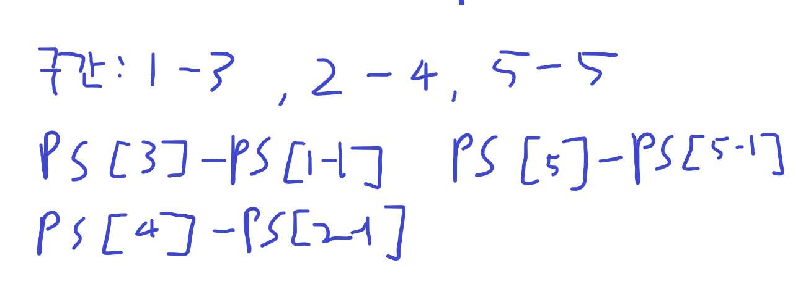
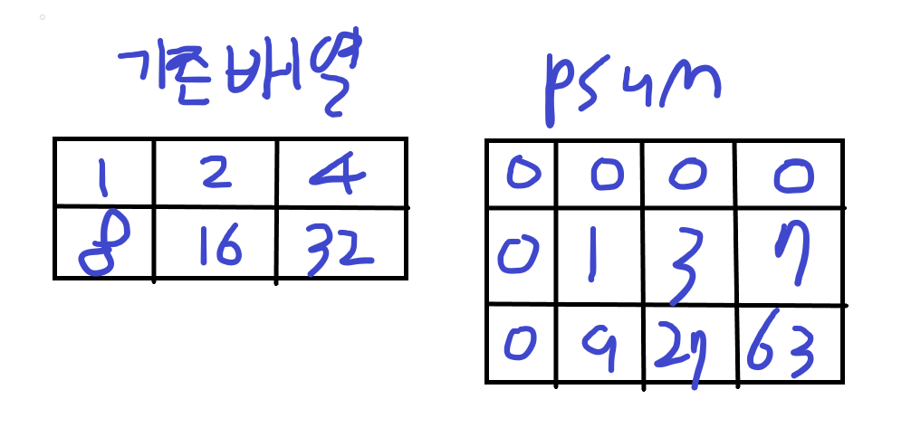
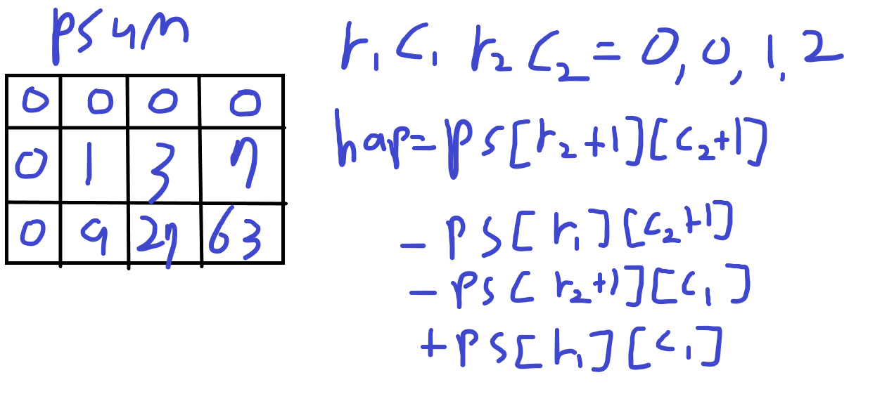
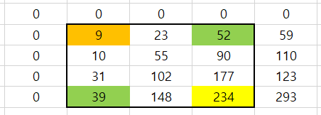

# 구간합

- 정의

**리스트에서 인덱스 범위 내의 요소들의 합을 계산하는 방법**

정적배열이 주어졌을 때 배열의 요소를 새로운 배열에 미리 계산해두고

특정 구간의 계산결과를 반환하는 알고리즘

- 1차원 구간합
1. 구간합 배열 생성

```python
psum = [0] * (n + 1) # 구간합 배열을 생성 -> 편의를 위해 0번 인덱스는 만들고 안씀

for i in range(1, n + 1): 
    psum[i] += psum[i - 1] + arr[i - 1] # 구간합 배열에 리스트 요소를 더함
```

<aside>
💡 1부터 시작하는 이유

- 구간합 배열의 `i-1` 을 기준으로 더해줄 것이기 때문에 인덱스 에러 발생을 막기

- 주어진 배열의 값을 더할때도 `-1` 으로 접근하면 0번 인덱스부터 접근 가능
  
  </aside>
1. 합을 구해야 하는 배열값을 찾음



```python
for _ in range(m): # 구간을 입력받는 반복문
    a, b = map(int, input().split())
    print(psum[b] - psum[a-1]) # 합을 구해야하는 최고(高) 인덱스 - 최소 인덱스 - 1
```

<aside>
💡 최소 인덱스 -1 을 해주는 이유

구간합 배열은 값이 계속해서 누적되는 구조이기 때문에 불필요한 값을 하나 빼줘야함

ex) 2~4 구간의 합을 구할때

실제 구간의 합은 `2 + 3 + 4 = 9` 하지만 구간합 배열에서 4번 인덱스는 `10`

이는 필요하지 않은 1번구간이 포함된 값이기 때문이다

즉 인덱스를 `-1` 해주는 이유는 불필요한 구간의 합을 제외하기 위해서

</aside>

- 2차원 구간합
1. 구간합 배열 생성



```python
psum = [[0]*(m+1) for _ in range(n+1)]

for r in range(1,n+1): # 계산 편의를 위해 테두리를 0으로 감쌌기 때문에 1부터 시작
    for c in range(1,m+1):
        psum[r][c] += arr[r-1][c-1] + psum[r-1][c] + psum[r][c-1] - psum[r-1][c-1]
```

<aside>
💡 2차원 배열 구간합을 계산하는 방법

1. 기준배열[r-1][c-1] 을 구간합 배열에 더한다
2. 구간합 배열의 좌측 값을 더한다
3. 구간합 배열의 위측 값을 더한다
4. 구간합 배열의 대각선 좌상단 값을 뺀다

`psum[r][c]` 

`+= arr[r-1][c-1] - (1)` 

`+ psum[r-1][c] - (2)`

`+ psum[r][c-1] - (3)`

`- psum[r-1][c-1] - (4)`

</aside>

1. 구간합 배열을 사용



<aside>
💡 구간합 배열에서 합을 구하는 방법




주어진 범위(r1, c1, r2, c2)가 0, 0, 2, 1 이라고 할때

노란색 - 초록색 - 초록색 + 주황색 순으로 계산을 한다

식은 다음과 같다

- 인덱스 기준일때 (0부터 시작)

`psum[r2 + 1][c2 + 1] - psum[r1][c2 + 1] - psum[r2 + 1][c1] + psum[r1][c1]`

- 인덱스 기준이 아닐때(1부터 시작)

`psum[r2][c2] - psum[r1 - 1][c2] - psum[r2][c1 - 1] + psum[r1 - 1][c1 - 1]`

</aside>

모르겠으면 외웁시다!